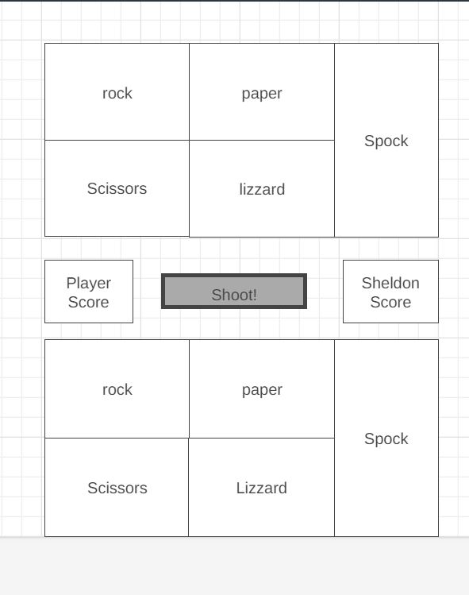
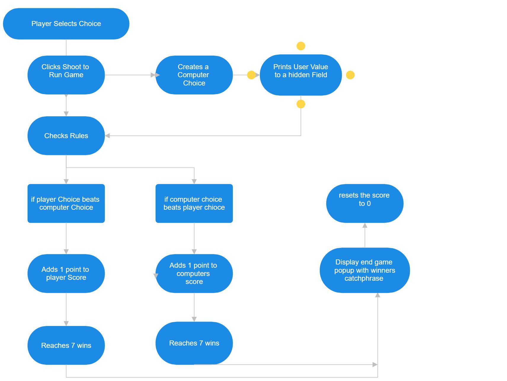
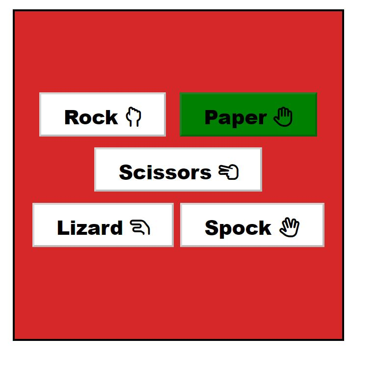
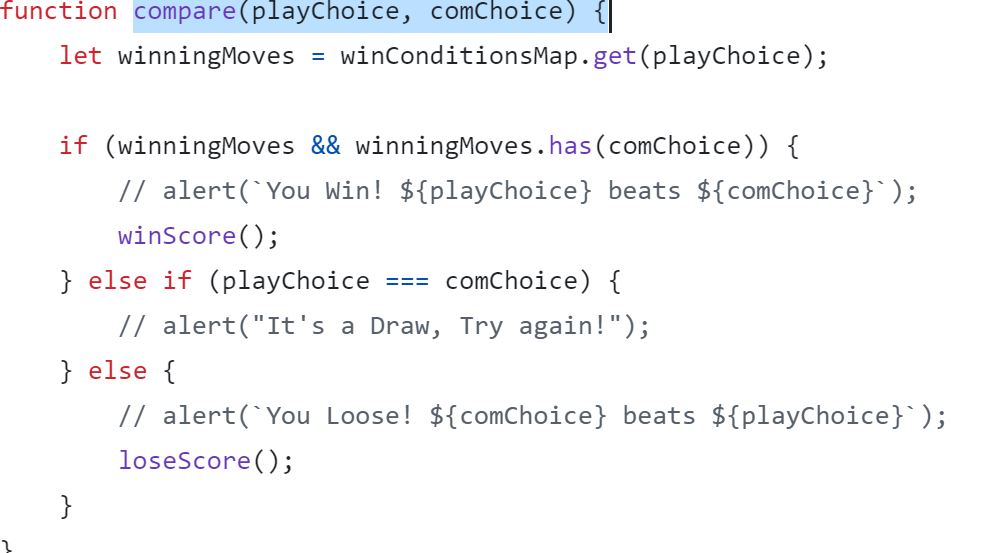
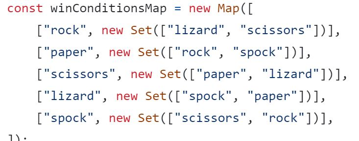
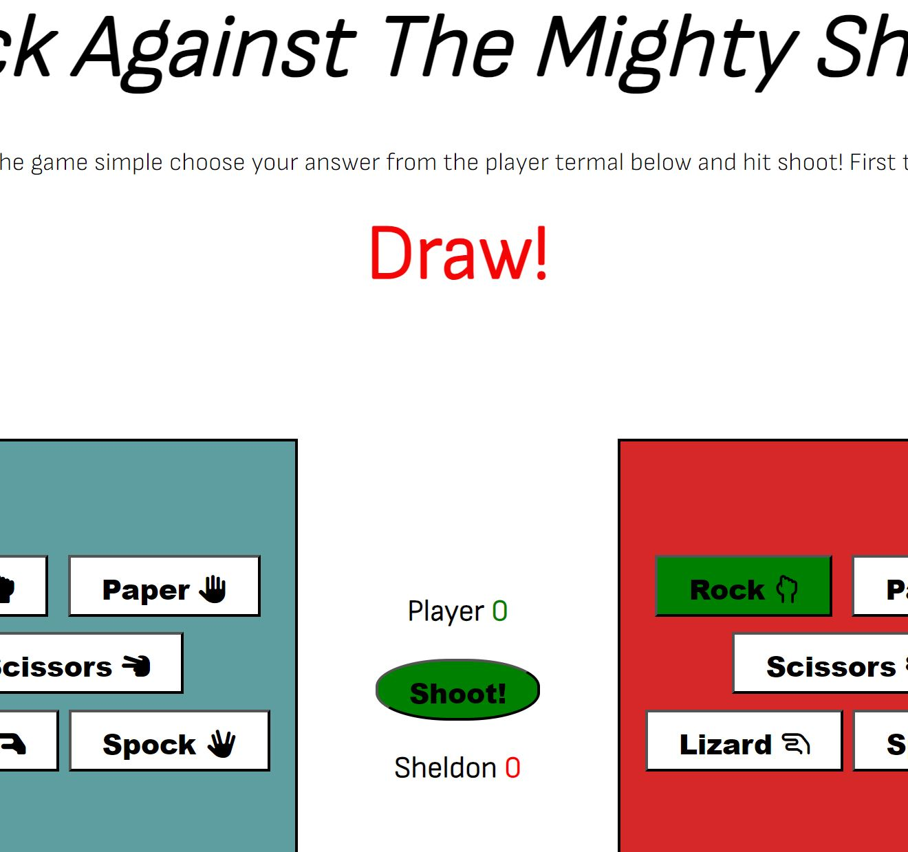
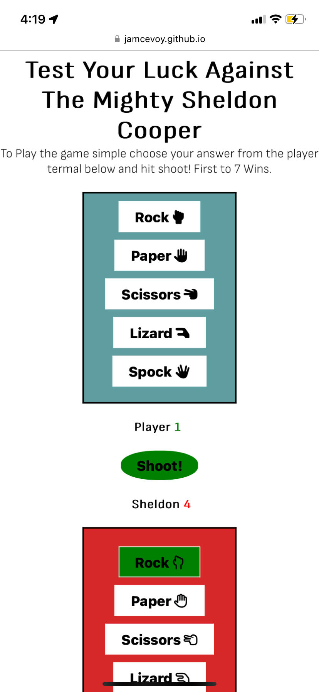
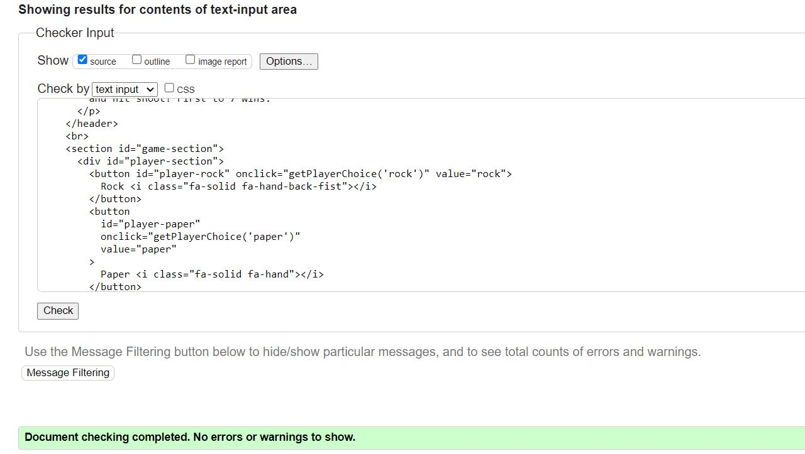

# Rock, Paper, Scissors, Lizard, Spock

[R.P.S.L.S](https://jamcevoy.github.io/RPSLS/)

R.P.S.L.S is my spin on the sitcom's favorite game of Rock, Paper, Scissors, Lizard, Spock.

My aim for this game is that it will be accessible to multiple age groups with an easy-to-understand design and a fun little throwback to the show. Like for example your opponent is the mighty Sheldon Cooper.

# User Needs

- As a user, I would want the game to be accessible from different devices (Phone, Laptop, PC, Tablet).
- As a user I would like it to be responsive to all screens, ensuring the information is readable and understandable.
- As a user, I would want to see easy-to-understand control, with good use of white space.
- As a user, I would need a section where the rule would be displayed at all times.
- Somewhere to keep score.

# Planning

- Before I could start this project I first needed to get the planned layout, process or flow of the game, and most importantly the rules.

## Planned Design

- First, how did I want the site to look where did I want what, and what placement on smaller screens using wireframe I created my layout

### Large Screen Layout

### Types of Elements

### Small Screen Layout

## Game Flow and Possible Functions

- Then I need to map the flow of the game. Which involved many questions.
  - When does the game start?
  - how does the user pick?
  - how does the computer pick?
  - What will add to the score?
  - how can I apply these parameters to functions?

- So I wrote out how Imagined the game running and then used this as a logical wireframe of the game.
- I also thought that creating a flow chart would better structure my idea

## Rules

- Scissors cuts Paper
- Paper covers Rock
- Rock crushes Lizard
- Lizard poisons Spock
- Spock smashes Scissors
- Scissors decapitate Lizard
- Lizard eats Paper
- Paper disproves Spock
- Spock vaporizes Rock
- Rock crushes Scissors

# Features

### Existing Features

#### Player Choices

- The user's buttons are where the player can select which option they choose. This then copies the value to a hidden field to be used in the game.
- Each click resets the hidden field to blank to stop any mistakes.
- I accomplished this using innerHTML.

- The button stays green once clicked to let the user know the option which will be played.

#### Computer Choices

- The computer choices are buttons like the user, However, they do not have any function when clicked.
- I kept the user choices to red background color to stay with the theme of the Big Bang theory, Sheldon flash t-shirt.
- Once the random number is generated in the background it will change the background color to green as it does with the user choices. They reset each turn using a function.

- The random number generated in the background is also the computer's choice. This pulls an option from a defined array

#### Score and Shoot

- This section is where the main functionality of the game is.
- Here the score is kept each round starts with player 0 - Sheldon 0 and is reset after 7 wins have been achieved from either side.
- The Submit button is used to run the game once this button is clicked it will call the checkRules function which brings the user and computer to a map and picks a winner of these rules.

- I originally used a switch to check the rule but it ended up being very long, messy, and repetitive.

- So I split the check rule and made a new function compare() and a map of the values and what they beat. This allowed me to minimize the lines used and make the code more readable.

#### Rules

- The rules section is a quote taken directly from the show! By Sheldon himself!
- Again bring the origin of the game back to the show.

### Draw Heading

- In the event of a draw I created a little red heading to display this to the user.

- Using the the add class function I can hide and display this heading based on whether the options are equal (show) or not (hide)

- The hide functionality is in the check rules function so each round this heading will be hidden to stop it from appearing again after a draw has already been thrown.

#### Game Over

- Once a player or Computer wins 7 games it calls a function openPopup which displays the box below the text differently based on whether the player won or the user won.
- When the computer wins you will see another nod to the Big Bang theory being that Sheldon's catchphrase is displayed.
- If the user wins you get a simple congratulations!

- The open popup is called in the function for the win score and for loss score
- I used the classList.add to add the class name and display the popup.
- The Close button on the popup calls a close popup Function using onclick so we can close the pop-up and try again.
- I used the classList.remove to remove the class name and display the popup.

### Features Left to Implement

- If I were to add more features to this game would probably be some animations depending on whether you won or lost.
- I think the game has the potential to Play Player vs, Player but I think this requires a lot more work and configuration.
- I wanted to add a popup that displays each win based on the values, for example, paper covers rock. However, using alerts didn't seem too convenient for the user.
- I think some audio would make the game more interactive, if Sheldon wins maybe play an audio clip of his famous catchphrase.

# Testing

- I tested that this page works in different browsers: Chrome, Firefox, Microsoft Edge, and Safari.

- I confirmed the site was responsive using the Chrome dev tools device toolbar.
- I have asked some family and friends to try the game on a PC, laptop, and mobile phone (Andriod and iPhone).
- Using the console.log function and alerts I tested if the computer was outputting correct vaults on the devtools console.

### Choices test

#### Aim - To test that the computer is selecting different options and using each value of the user's options for one full game (up to 7 wins)

### Testing

#### Rock

    - Paper
    - Paper
    - Paper
    - Lizard
    - Paper
    - Lizard
    - Paper
    - Paper
    - Lizard
    - Scissors
    - Rock
    - Paper.

#### Paper

    - Spock
    - scissors
    - paper
    - paper
    - lizard
    - Spock
    - rock
    - Spock
    - paper
    - Spock
    - lizard
    - Scissors
    - lizard
    - paper
    - scissors
    - Spock
    - Spock

#### scissors

    - Lizard
    - scissors
    - rock
    - Spock
    - Spock
    - lizard
    - lizard
    - rock
    - scissors
    - scissors
    - scissors
    - rock
    - scissors
    - paper
    - paper
    - rock

#### Lizard

    - Spock
    - scissors
    - rock
    - scissors
    - Spock
    - Scissors
    - Spock
    - paper
    - Spock
    - paper
    - scissors
    - paper

#### Spock

    - Spock
    - rock
    - scissors
    - lizard
    - lizard
    - paper
    - Spock
    - paper
    - paper
    - rock
    - rock
    - paper
    - Spock
    - paper

### Conclusion

- Between the five tests I couldn't see any specific patterns, Between each run of the game. This leads me to believe the random numbers are being generated successfully.

### User testing

- In this user test I thought it best to have the user be in two separate age groups to refer back to 'My aim for this game is that it will be accessible to multiple age groups'

- **User 1** - I asked my grandmother, 67 years old to try the game, At first she found it hard to understand what to do. Even after explaining.
  - **User Comments** - She said "There isn't enough happening on screen to show me what I am supposed to do"
    - **Notes** - Maybe adding some color to the screen like for computer choices of the user choice to let the user know where they need to make their choice.
- **User 2** - I let my cousin Aisha, 8 years old to try play the game.
  - **User Comments** - She said "It's a fun game but very annoying when I press the shoot button the screen is blocked by an alert.".
    - **Notes** - Maybe some sort of stylish type of popup can display alerts of the end of the game or draw.

### Validator Testing

- HTML
  - No errors were returned when passing through the official [W3C validator](https://validator.w3.org/nu/#textarea)
    
- CSS
  - No errors were found when passing through the official [(Jigsaw) validator](https://jigsaw.w3.org/css-validator/validator)
    
- JavaScript
  - no errors were found [JS Hint](https://jshint.com/)
    

### Bugs I Faced Along The Way

- I didn't face many bugs in the creation of this game, One issue I did have was changing the background color on the button selected by the user and the pc. I tried to use one function for each side but this prevented the game from running when I hit submit so instead, I used JavaScript for the computer choice using the changeButtonColor() and used CSS pseudo-class for the player choice.
- Using the alerts to display the end game-winner made for a bad user experience, So I decided to use a popup instead. I was not sure how I could do this so I researched possible solutions online and found a tutorial online on how to create one I changed the style a bit and added my text and using spans I displayed the winner's catchphrase and a little text displaying _name_ has won 7 games first!.
- I faced a bug with code anywhere when I was making some minor changes to the readme, I ran a commit but nothing pushed through so I checked back and the file was unsaved. I saved the file and ran the commit again with the same message and this pushed it through and caused two commits to be pushed over to git with the same commit message. I noticed this save issue a few times throughout the creation of this project but was not a major problem.

### Bugs I did not get to fix

- I couldn't think of a way to display when a user has not selected an option without using alerts. I thought maybe another pop-up but I feared this would make the code and display a bit messy and repetitive as I would need to use the same styles and functions as the end-game pop-up. Currently, if the user opens the page and press shoot it throws "No User Choice has been selected". before this, the score would just be given to the computer until the user made a choice or the score reached 7. I feel like to fix this I would need to restructure the game flow and code and I did not have enough time to pick it apart and try different things. I feel with more time and research I could find a solution and cross this bug off.
- I wanted the user's choice to display alongside the computer's choice each round but because I used the focus class for the user's choice the color drops once the submit button is selected. I would need more time a research to look into possible solutions that wouldn't affect the running of the game.

## Deployment

This section describes how to create a new repository.

- This repository was created using [GitHub](https://github.com/) The steps are as followed:
  - I went to the [Code Institute Template](https://github.com/Code-Institute-Org/ci-full-template)
  - I selected the green button labeled 'Use this template'
  - Then, Create a new repository.
  - Then I was brought to a new page to set the name and setting for my new repository.
  - I named my repository 'R.P.S.L.S'

This section describes how I set up my workspace, Once my repository has been created.

- The workspace I used for this project was [codeanywhere](https://app.codeanywhere.com/). The steps are as follows:
  - I opened [GitHub](https://github.com/) and went to the 'R.P.S.L.S' repository
  - To get the link for codeanywhere I clicked the green button '<>code'.
  - Here under local, I could copy the link needed: <https://github.com/JAmcevoy/R.P.S.L.S.git>
  - Then I went to code anywhere.
  - In workplaces, I selected new workspaces
  - Here I copied the link from the git hub and clicked to create to make my workspace.

This section describes the commands I used in code anywhere to push my code and changes to GitHub.

    -  I created the files and folders needed for my project.
      - index.html
      - assets folder
        - css folder
          - style.css
        - icon folder
        - js folder
          - script.js
        - images
      - Docs
        - images
    - I used the git add . command to add all changes above.
    - Using the git commit command I committed the change and used -m to attach a message to the commit.
    - When I was finished with the creation I used git push to push all these files and folders to GitHub.
    - I used these same 3 commands through the creation and modification

This section should describe the process I went through to deploy the project to a hosting platform.

- The site was deployed to GitHub pages. The steps to deploy are as follows:
  - In the GitHub repository, navigate to the Settings tab
  - From the source section drop-down menu, select the Master Branch
  - Once the master branch has been selected, the page will be automatically refreshed with a detailed ribbon display to indicate the successful deployment.

The live link can be found here - <https://jamcevoy.github.io/RPSLS/>

## Credits

- I used these resources to research and develop my understanding of JavaScript, as well as get inspiration for my own code. During this research, I have borrowed some ideas and modified the code to suit my project. No code was used unedited

### Design

- All the design screenshots from above came from [Wirframe](https://wireframe.cc/)
- The flowchart created for the planning section was created with [Smart Draw](https://app.smartdraw.com/editor.aspx?templateId=da34e096-b9cb-4d56-a0ce-d9bdef138714&flags=128#depoId=52632460&credID=-57250829)

### Code

- Here I learned more about how to select a random item from an array to use for computer choice - [Geeks For Geeks](https://www.geeksforgeeks.org/how-to-select-a-random-element-from-array-in-javascript/)
- Here I learned more about how to print the value of the button to input box on click function- [Stack overflow](https://stackoverflow.com/questions/67653377/how-to-print-value-of-button-to-input-box-onclick-function)
- I used this project to better understand how this game would work and structure, I later changed the else if to a switch statement but then decided a map was a more reasonable option. [Git Hub](https://github.com/TomZebra/Rock-Paper-Scissors-Spock-Lizzard/blob/main/app.js)
- Here I learned about how to set an HTML value back to zero [Stack overflow](https://stackoverflow.com/questions/37580280/how-to-reset-a-counter-back-to-0-with-a-button-in-javascript)
- End of the game pop-up, This is the closest I followed the code as the function was simple but I used my own styling and structure. Then used the same type of function to display my draw heading. In my code, the function is called after 7 games instead of an open button. [Youtube](https://youtu.be/AF6vGYIyV8M?feature=shared)
- The Scores Section was based on the Love Maths Project, I used the same two lines to add to the score but then went further to add the function to reset the score back to zero after the player or computer reaches 7 [Love Maths](https://github.com/JAmcevoy/LoveMaths)
- For each statement for the background color of the comChoice this helped me better understand the statement and apply it to my codes function [Free Code Camp](https://www.freecodecamp.org/news/javascript-foreach-how-to-loop-through-an-array-in-js/#:~:text=The%20forEach%20method%20passes%20a,The%20current%20element's%20index%20number)

### Content

- Because of the origin of this game names, rules, and catchphrases were all taken from the TV show The Big Bang Theory.
- All Icons were taken from [Font Awesome](https://fontawesome.com/)
