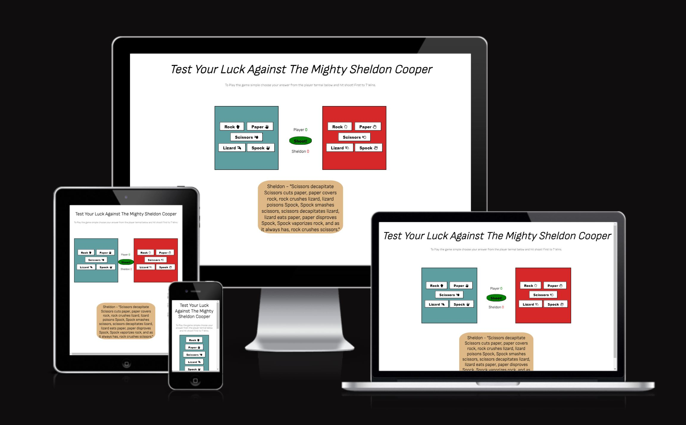
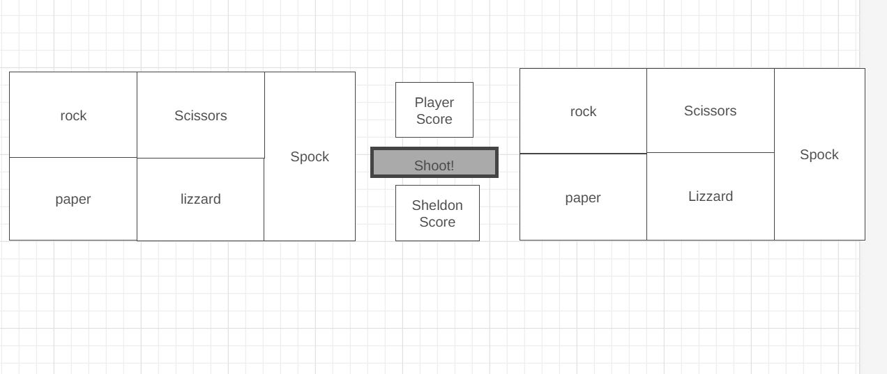
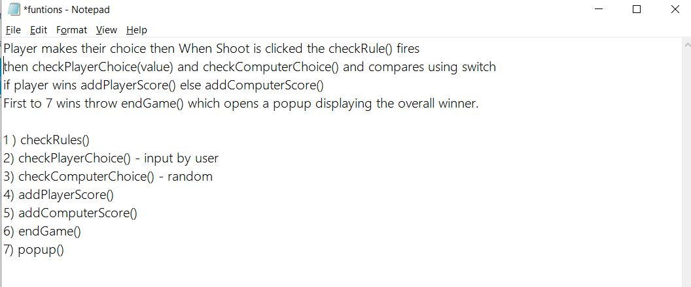
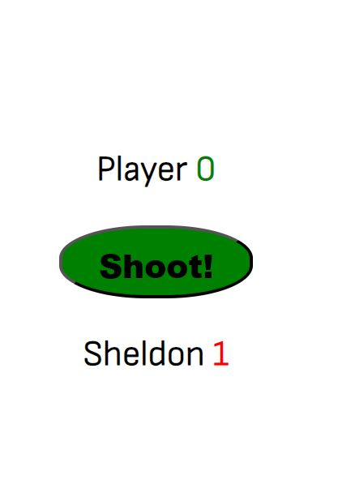
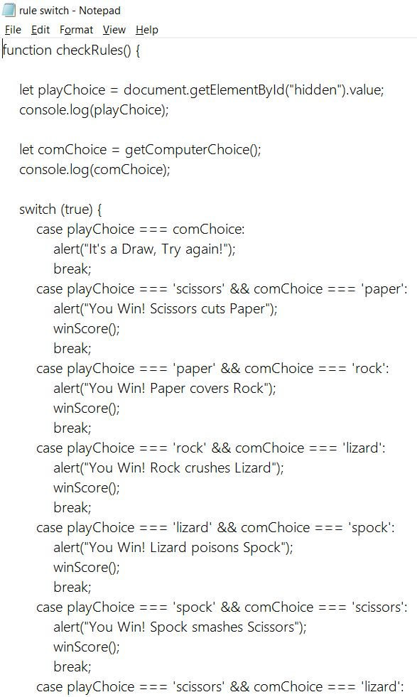
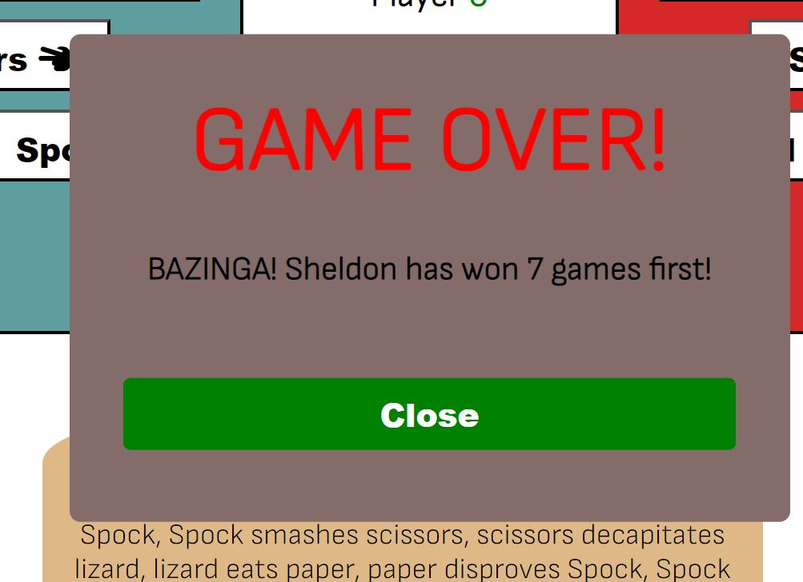
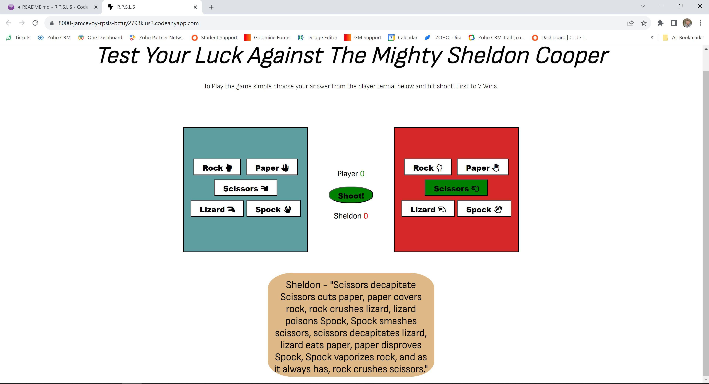
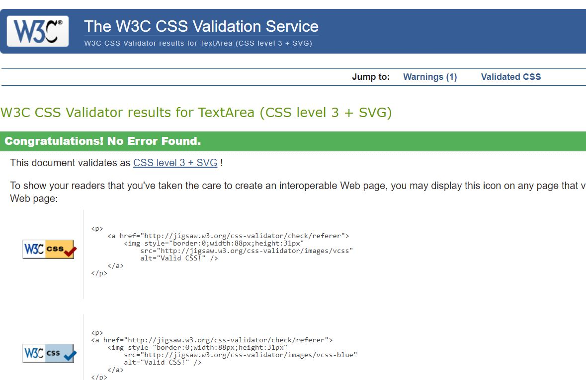

# Rock, Paper, Scissors, Lizard, Spock

[R.P.S.L.S](https://jamcevoy.github.io/R.P.S.L.S/)

R.P.S.L.S is my spin on the sitcom's favorite game of Rock, Paper, Scissors, Lizard, Spock.

My aim for this game is that it will be accessible to multiple age groups with an easy-to-understand design and a fun little throwback to the show. Like for example your opponent is the mighty Sheldon Cooper.

# User Needs

- I would want the game to be accessible from different devices (Phone, Laptop, PC, Tablet).
- It would need to be responsive to all screens, ensuring the information is readable and understandable.
- As a user, I would want to see easy-to-understand control, with good use of white space.
- I would need a section where the rule would be displayed at all times.
- Somewhere to keep score.

# Planning

- Before I could start this project I first needed to get the planned layout, process or flow of the game, and most importantly the rules.

## Planned Design

- First, how did I want the site to look where did I want what, and what placement on smaller screens using wireframe I created my layout

### Large Screen Layout

### Types of Elements

### Small Screen Layout

## Game Flow and Possible Functions

- Then I need to map the flow of the game. Which involved many questions.
  - When does the game start?
  - how does the user pick?
  - how does the computer pick?
  - What will add to the score?
  - how can I apply these parameters to functions

- So I wrote out how Imagined the game running and then used this as a logical wireframe of the game.

## Rules

- Scissors cuts Paper
- Paper covers Rock
- Rock crushes Lizard
- Lizard poisons Spock
- Spock smashes Scissors
- Scissors decapitate Lizard
- Lizard eats Paper
- Paper disproves Spock
- Spock vaporizes Rock
- Rock crushes Scissors

# Features

### Existing Features

#### Player Choices

- The user's buttons are where the player can select which option they choose. This then copies the value to a hidden field to be used in the game.
- Each click resets the hidden field to blank to stop any mistakes.
- The button stays green once clicked to let the user know the option which will be played.

#### Computer Choices

- The computer choices are buttons like the user, However, they do not have any function when clicked.
- I kept the user choices to red background color to stay with the theme of the big bang theory, Sheldon flash t-shirt.
- Once the random number is generated in the background it will change the background color to green as it does with the user choices. They reset each turn using a function.

#### Score and Shoot

- This section is where the main functionality of the game is.
- Here the score is kept each round starts with player 0 - Sheldon 0 and is reset after 7 wins have been achieved from either side.
- The Submit button is used to run the game once this button is clicked it will call the checkRules function which brings the user and computer to a map and picks a winner of these rules.

- I originally used a switch to check the rule but it ended up being very long, messy, and repetitive.

- So I split the check rule and made a new function compare() and a map of the values and what they beat. This allowed me to minimize the lines used and make the code more readable.

#### Rules

- The rules section is a quote taken directly from the show! By Sheldon himself!
- Again bring the origin of the game back to the show.

#### Game Over

- Once a player or Computer wins 7 games it calls a function openPopup which displays the box below the text differently based on whether the player won or the user won.
- When the computer wins you will see another nod to the Big Bang theory being that Sheldon's catchphrase is displayed.
- If the user wins you get a simple congratulations!
- The Close button on the popup calls a close popup Function so we can close the pop-up and try again.

### Features Left to Implement

- If I were to add more features to this game would probably be some animations depending on whether you won or lost.
- I think the game has the potential to Play Player vs, Player but I think this requires a lot more work and configuration.
- I wanted to add a popup that displays each win based on the values, for example, paper covers rock. However, using alerts didn't seem too convenient for the user.
- I think some audio would make the game more interactive, if Sheldon wins maybe play an audio clip of his famous catchphrase.

## Testing

- I tested that this page works in different browsers: Chrome, Firefox, Microsoft Edge, and Safari.

- I confirmed the site was responsive using the Chrome dev tools device toolbar.
- I have asked some family and friends to try the game on a PC, laptop, and mobile phone (Andriod and iPhone).
- Using the console.log function and alerts I tested if the computer was outputting correct vaults on the devtools console.

### Validator Testing

- HTML
  - No errors were returned when passing through the official [W3C validator](https://validator.w3.org/nu/#textarea)
    
- CSS
  - No errors were found when passing through the official [(Jigsaw) validator](https://jigsaw.w3.org/css-validator/validator)
    
- JavaScript 
  - no errors were found.
    [JS Hint](https://jshint.com/)
    

### Bugs I Faced Along The Way

- I didn't face many bugs in the creation of this game, One issue I did have was changing the background color on the button selected by the user and the pc. I tried to use one function for each side but this prevented the game from running when I hit submit so instead, I used JavaScript for the computer choice using the changeButtonColor() and used css pseudo-class for the player choice.
- Using the alerts to display the end game-winner made for a bad user experience, So I decided to use a popup instead. I was not sure how I could do this so I researched possible solutions online and found a tutorial online on how to create one I changed the style a bit and added my own text and using spans I displayed the winner's catchphrase and a little text displaying *name* has won 7 games first!.

### Bugs I did not get to fix

- I couldn't think of a way to display draws without using alerts. I thought maybe another pop-up but I feared this would make the code and display a bit messy and repetitive as I would need to use the same styles and functions as the end-game pop-up.
- I wanted the user's choice to display alongside the computer's choice each round but because I used the focus class for the user's choice the color drops once the submit button is selected. I would need more time a research to look into possible solutions that wouldn't affect the running of the game.

## Deployment

This section should describe the process you went through to deploy the project to a hosting platform (e.g. GitHub)

- The site was deployed to GitHub pages. The steps to deploy are as follows:
  - In the GitHub repository, navigate to the Settings tab
  - From the source section drop-down menu, select the Master Branch
  - Once the master branch has been selected, the page will be automatically refreshed with a detailed ribbon display to indicate the successful deployment.

The live link can be found here - <h<https://jamcevoy.github.io/R.P.S.L.S/>>

## Credits

### Design

- All the design screenshots  from above came from [Wirframe](https://wireframe.cc/)

### Code

- How to Select a random item from an array - [Geeks For Geeks](<https://www.geeksforgeeks.org/how-to-select-a-random-element-from-array-in-javascript/>)
- How to print the value of the button to input box on click function- [Stack overflow](https://stackoverflow.com/questions/67653377/how-to-print-value-of-button-to-input-box-onclick-function)
- Used for inspiration [Git Hub](https://github.com/TomZebra/Rock-Paper-Scissors-Spock-Lizzard/blob/main/app.js)
- How to set an HTML value back to zero [Stack overflow](https://stackoverflow.com/questions/37580280/how-to-reset-a-counter-back-to-0-with-a-button-in-javascript)
- End of the game pop up [Youtube](https://youtu.be/AF6vGYIyV8M?feature=shared)
- The Scores Section was based on the Love Maths Project [Love Maths](https://github.com/JAmcevoy/LoveMaths)

### Content

- Because of the origin of this game names, rules, and catchphrases were all taken from the TV show The Big Bang Theory.
